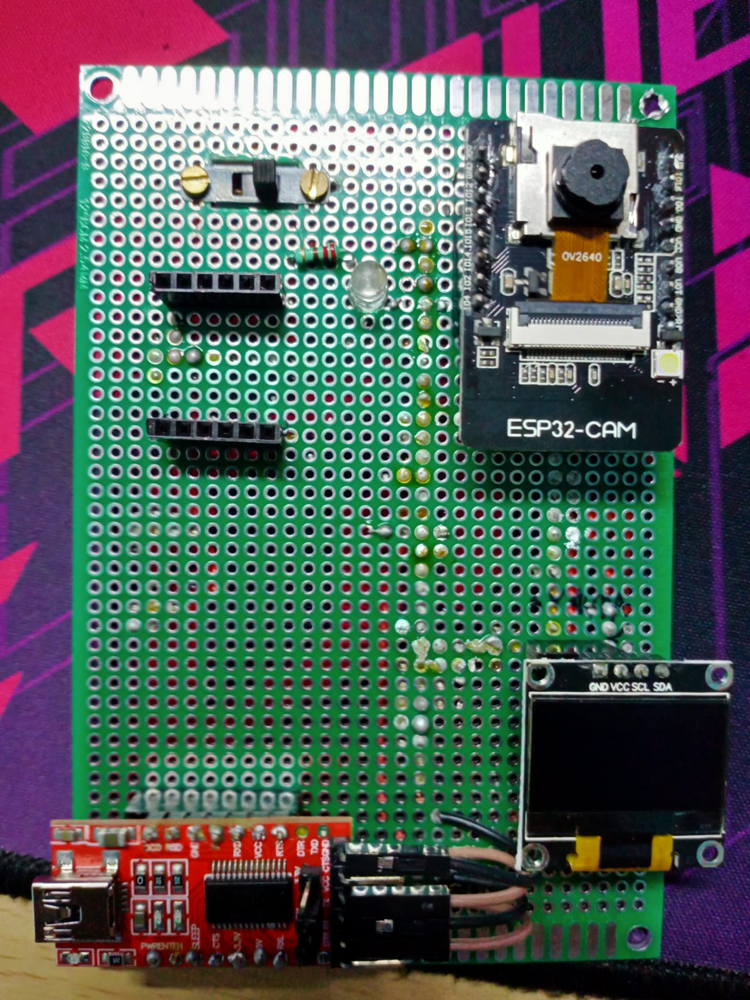

# EdgeBlink

**EdgeBlink** is a real-time object detection system running entirely on the ESP32-CAM using a quantized TensorFlow Lite model. Optimized with the EON™ Compiler, it delivers \~1.4 FPS with minimal memory usage, displays results on an OLED, and supports both USB and standalone battery-powered operation for portable AI-IoT applications.

<div align="center" style="border: 2 px solid #ccc; padding: 10 px; display: inline-block;">
  
</div>

## 🚀 Features

- **Real-time Object Detection**: Detects bitter gourd, onions, and tomatoes
- **High Accuracy**: 100% F1 score on validation set
- **Optimized Performance**: 695ms inference time with quantized int8 model
- **Low Memory Footprint**: 239.4K RAM usage, 81.1K flash usage
- **OLED Display**: Real-time detection results visualization
- **Independent Power Supply**: MP1584 buck converter support for standalone operation

## 📊 Model Performance

### Training Results


- **F1 Score**: 100.0%
- **Precision**: 1.00
- **Recall**: 1.00
- **Model Version**: Quantized (int8)

### Confusion Matrix

The model achieves perfect classification across all three classes:

| Class | Background | Bitter Gourd | Onion | Tomato |
|-------|------------|--------------|--------|---------|
| **Background** | 100% | 0% | 0% | 0% |
| **Bitter Gourd** | 0% | 100% | 0% | 0% |
| **Onion** | 0% | 0% | 100% | 0% |
| **Tomato** | 0% | 0% | 0% | 100% |

### Training Data Distribution


The model was trained on a balanced dataset with samples distributed across different scenarios and lighting conditions.

## ⚡ Performance Metrics

### On-Device Performance


- **Inference Time**: 695ms
- **Peak RAM Usage**: 119.4K
- **Flash Usage**: 81.1K
- **Overall Accuracy**: 98.46%

### Detailed Timing Breakdown


- **Image Processing**: 15ms latency, 4.0K RAM
- **Object Detection**: 1,085ms latency, 239.4K RAM
- **Total Pipeline**: 1,100ms

## 🔧 Hardware Requirements

| **Component**                              | **Details**                                                                 |
|--------------------------------------------|-------------------------------------------------------------------------------|
| **ESP32-CAM Module**                       | OV2640 camera sensor                                                         |
| **OLED Display**                           | 128x64 resolution                                                            |
| **MP1584 Buck Converter**                  | Adjustable output for independent power supply                               |
| **FTDI USB-to-Serial Converter**           | For development and programming                                              |
| **Prototyping PCB**                        | For assembling components                                                    |
| **Header Pins & Jumper Wires**             | For connections                                                              |

| **Power Supply Mode**     | **Description**                                            | **Specifications**                     |
|---------------------------|------------------------------------------------------------|------------------------------------------|
| **Development Mode**      | USB power via FTDI module                                  | —                                        |
| **Production Mode**       | MP1584 buck converter for standalone battery operation     | Input: 4.5V–28V, Output: 5V adjustable, Up to 3A |

## 📁 Project Structure

```
EdgeBlink/
├── img/                               # Documentation images
├── pcb/                               # PCB design files
│   ├── dct.kicad_prl                  # KiCad project files
│   ├── dct.kicad_pro                  # KiCad pro files
│   ├── dct.kicad_sch                  # Schematic files
│   └── fp-info-cache                  # Footprint cache
├── src/                               # Source code
│   ├── edge-impulse-sdk/              # Edge Impulse SDK
│   ├── model-parameters/              # Model configuration
│   ├── tflite-model/                  # TensorFlow Lite model
│   └── detect-esp32cam_inferencing.h  # Main inference header
│ 
├── detect.ino                         # Main Arduino sketch
├── library.properties                 # Library properties
└── README.md                          # This file
```

## 💻 Real-Time Detection Output

The system provides real-time detection feedback through serial output:


## 🔧 Model Optimization

The model uses several optimization techniques for ESP32 deployment:

### EON™ Compiler Optimization
- **17% less RAM usage**
- **36% less ROM usage** 
- **Same accuracy maintained**

### Quantization Benefits
- **Model Type**: Quantized (int8)
- **Size Reduction**: Significant memory footprint reduction
- **Speed Improvement**: Faster inference times
- **Accuracy Retention**: No loss in detection accuracy


## 📈 Technical Specifications

### Performance Characteristics
- **Frame Rate**: ~1.4 FPS (695ms inference + processing time)
- **Resolution**: Optimized for ESP32-CAM sensor capabilities
- **Detection Range**: Optimized for close-range object identification
- **Power Consumption**: Low power design suitable for battery operation


## 🙏 Acknowledgments

- Edge Impulse for the machine learning platform
- ESP32 community for hardware support
- TensorFlow Lite team for model optimization tools
